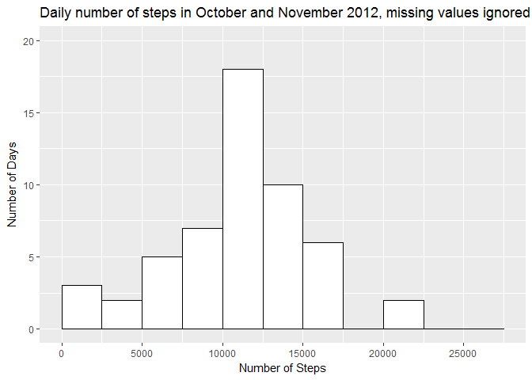
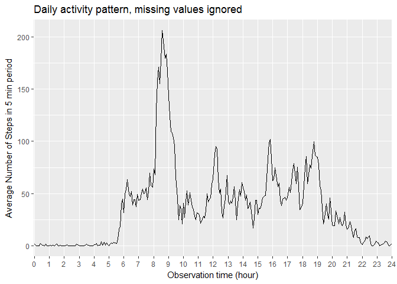
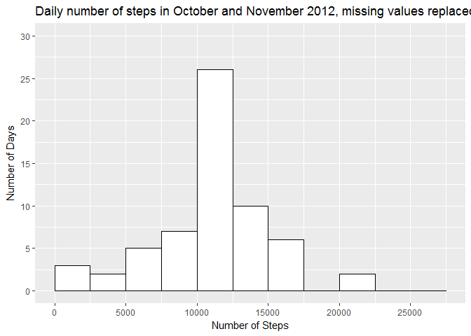
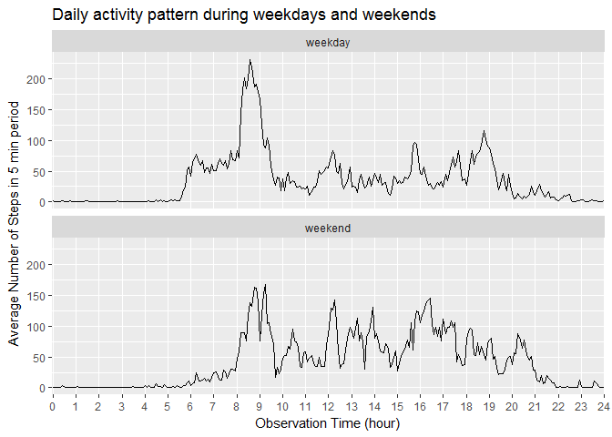

# Reproducible Research: Peer-graded Assignment 1
Maaike Miedema  
March 15, 2017  


## Introduction

This document describes the analysis performed as part of the assignment of the 
Coursera Course Reproducible Research, week 2. Goal of this assignment is to 
perform some analysis in R and write a report in R Markdown which contains the 
results as well as the code which produces those results. 

## About the Data

The datafile activity.csv has been downloaded March 15, 2017
from https://github.com/rdpeng/RepData_PeerAssessment1. It contains data 
collected by an activity monitoring device which collects data at 5 minute intervals
The data has been collected during two months, October and November 2012, by one 
individual and includes:

- **steps:** the number of steps taken in 5 minute interval
- **date:** the date in YYYY-MM-DD format
- **interval:** identifier for the 5 minute interval

## Packages used
The following pakages have been used: dplyr, ggplot2. They are loaded by:

```r
library(dplyr)
library(ggplot2)
```

## Loading and preprocessing the data

#### Loading
Requirement: the data file activity.zip is available in the working directory.
The data is loaded by:


```r
unzip(zipfile="activity.zip")
AMData<- read.csv("activity.csv")
```
<br />   

#### A quick look at the data


```r
str(AMData)
```

```
## 'data.frame':	17568 obs. of  3 variables:
##  $ steps   : int  NA NA NA NA NA NA NA NA NA NA ...
##  $ date    : Factor w/ 61 levels "2012-10-01","2012-10-02",..: 1 1 1 1 1 1 1 1 1 1 ...
##  $ interval: int  0 5 10 15 20 25 30 35 40 45 ...
```
**Note: ** 

- The variable date is a factor
- The variable interval denotes time of observation and has type integer
- The variable steps shows missing values
- The number of observations 17568 = (31+30)x24x12, so Daylight Saving Time has 
no effect on the interval series

Have a closer look at the interval values

```r
with(AMData,c(min(steps,na.rm = TRUE), max(steps,na.rm = TRUE)))
```

```
## [1]   0 806
```
So, the minimum number of steps is zero, the maximum number is 806, which is 
reasonable, about 2.5-3 steps/second. 

According to https://www.timeanddate.com/time/change/usa?year=2012 Daylight 
Saving Time ended November 4, 2012 at 2.00 am.  All "steps" observations( 288=24x12) 
on November 4 are missing:

```r
sum(is.na(filter(AMData,date=="2012-11-04")))
```

```
## [1] 288
```

<br /> 

#### Preprocessing
As the interval concerns time, the class of variable date is changed from factor 
to Date. 


```r
AMData$date <- as.Date(AMData$date)
```

## What is mean total number of steps taken per day?
The total number of steps per day is calculated and plotted in a histogram. 
Missing values are ignored.


```r
stepsTotal <- summarize(group_by(AMData, date), sum(steps))
colnames(stepsTotal) <- c("date","dailyTotal")
ggplot(data = stepsTotal, aes(x=dailyTotal)) +
        geom_histogram(breaks= 2500*c(0:11), 
                       na.rm=TRUE,
                       fill = "white",
                       color = "black") +
        ggtitle("Daily number of steps in October and November 2012, missing values ignored") +
        scale_x_continuous(name = "Number of Steps", 
                           breaks =5000*c(0:5)) +
        scale_y_continuous(name = "Number of Days", 
                           breaks = 5*c(0:4), 
                           limits =c(0,20)) 
```

<!-- -->

Note that the difference between mean and median of the daily total number of 
steps is very small: 


```r
mean(stepsTotal$dailyTotal, na.rm = TRUE)
```

```
## [1] 10766.19
```

```r
median(stepsTotal$dailyTotal, na.rm = TRUE)
```

```
## [1] 10765
```


## What is the average daily activity pattern?
To see how the activity is distributed during the day the 
mean number of steps is calculated for each interval. A plot of those means 
versus their intervals is created by the code below.  
**Remarks:**

- the interval is factorized to get an even spread of the measurements over
  the x-axis.
- to be able to plot a value at 24h, the mean value for the measurement taken at 
  00:00 is duplicated, and interval value is changed from 0 to 2400. It is allowed 
  to do this because the time is cyclic. 
  This workaround is because I couldn't manage to set the x-axis boundaries another way.
  

```r
intervalMean<- summarize(group_by(AMData, interval), mean(steps, na.rm = TRUE))
colnames(intervalMean)<-c("interval", "meanSteps")
intervalMean<-rbind(intervalMean,intervalMean[1,]) 
intervalMean[289,1]<-2400                          
ggplot(data = intervalMean, aes(x = as.factor(interval),y=meanSteps, group=1)) + 
        geom_line() +
        ggtitle("Daily activity pattern, missing values ignored") +
        scale_x_discrete(name = "Observation time (hour)", 
                         breaks = 100*(0:24),
                         labels = 0:24) +
        scale_y_continuous(name = "Average Number of Steps in 5 min period")
```

<!-- -->
  

**Interval with the maximum number of steps** is 835 as calculated with the 
code below. On average most steps are taken between 8.30 and 8.35 am. 


```r
filter(intervalMean, meanSteps == max(meanSteps))$interval
```

```
## [1] 835
```


## Imputing missing values
In the previous calculations missing values have been ignored. To get an idea of 
the effect of missing values, they will be replaced and the analysis on the 
daily number of steps will be repeated.

#### Missing values
To get an impression on how much values are missing the number of missing values 
is calculated. 

```r
with(AMData,sum(is.na(steps)))
```

```
## [1] 2304
```
So, the total number of missing values is 2304, about 13% of the observations. 
It appears that 8 whole days are missing: 

```r
missing<-filter(AMData,is.na(steps))
summarize(group_by(missing, date), n())
```

```
## # A tibble: 8 × 2
##         date `n()`
##       <date> <int>
## 1 2012-10-01   288
## 2 2012-10-08   288
## 3 2012-11-01   288
## 4 2012-11-04   288
## 5 2012-11-09   288
## 6 2012-11-10   288
## 7 2012-11-14   288
## 8 2012-11-30   288
```
#### Replacing missing values
I've chosen to replace a missing value by the mean value of steps for a given 
interval. Those are stored in the data frame "intervalMean".
with this choice differences between the various days in the week are ignored. 
The new data frame is called ReplacedNAs

```r
ReplacedNAs<- merge(AMData, intervalMean)
ReplacedNAs <- select(ReplacedNAs,steps, date, interval, meanSteps)
ReplacedNAs <- arrange(ReplacedNAs, date)
NAs <- is.na(ReplacedNAs$steps)
ReplacedNAs[NAs,]$steps<-ReplacedNAs[NAs,]$meanSteps
```

With this new data set ReplacedNAs a new histogram is plotted, the same way as before:


```r
stepsTotalNA <- summarize(group_by(ReplacedNAs, date), sum(steps))
colnames(stepsTotalNA) <- c("date","dailyTotal")
ggplot(data = stepsTotalNA, aes(x=dailyTotal)) +
        geom_histogram(breaks= 2500*c(0:11), 
                       na.rm=TRUE,
                       fill = "white",
                       color = "black") +
        ggtitle("Daily number of steps in October and November 2012, missing values replaced") +
        scale_x_continuous(name = "Number of Steps", 
                           breaks =5000*c(0:5)) +
        scale_y_continuous(name = "Number of Days", 
                           breaks = 5*c(0:6), 
                           limits =c(0,30)) 
```

<!-- -->

Finally is checked what happens tot the mean and median by replacing NAs by average numbers.

 

```r
mean(stepsTotalNA$dailyTotal, na.rm = TRUE)
```

```
## [1] 10766.19
```

```r
median(stepsTotalNA$dailyTotal, na.rm = TRUE)
```

```
## [1] 10766.19
```
  
  
**Conclusion:**

 - the mean stays the same: this is expected as the days with NAs are replaced by 
 an average day.
 - the median equals the mean: the mean and median were so close that the introduced
 average days are clustered in the middle, causing mean and median becoming 
 exactly the same.
 
## Are there differences in activity patterns between weekdays and weekends?
To see whether the behaviour is different in weekdays from weekends, a new 
variable is added to ReplacedNAs. This variable "dayType" takes two values: "weekday" 
and "weekend". The function "strftime()" is used to convert dates to weekdays, 
because it is not locale-specific; strftime(date, %u) returns 
a character "1".."7", with Monday="1"


```r
days <- c(rep("weekday",5), rep("weekend",2))
ReplacedNAs$dayType <- days[as.integer(strftime(ReplacedNAs$date,"%u"))]
```

With the new data a panel plot is made to see whether the activity pattern during 
weekdays differs from weekends. The plotting code is rather similar to the first 
plot of the Daily Activity Pattern only facet_wrap is used to get the labeling on top 
of the plots 


```r
intervalMean2 <- summarize(group_by(ReplacedNAs, interval, dayType), mean(steps))
colnames(intervalMean2) <- c("interval", "dayType", "meanSteps")
intervalMean2 <- rbind(intervalMean2,intervalMean2[1:2,]) 
intervalMean2[577:578,1] <- 2400                          

ggplot(data = intervalMean2, 
       aes(x = as.factor(interval), y = meanSteps, group = 1)) +
        facet_wrap(~ dayType, ncol = 1) +
        geom_line()+
        ggtitle("Daily activity pattern during weekdays and weekends") +
        scale_x_discrete(name = "Observation Time (hour)", 
                         breaks = 100*(0:24),
                         labels = 0:24) +
        scale_y_continuous(name = "Average Number of Steps in 5 min period")
```

<!-- -->

Conclusion: in the weekends the person gets up later, is less active until about 
10 am, during the rest of the day he/she takes more steps.
